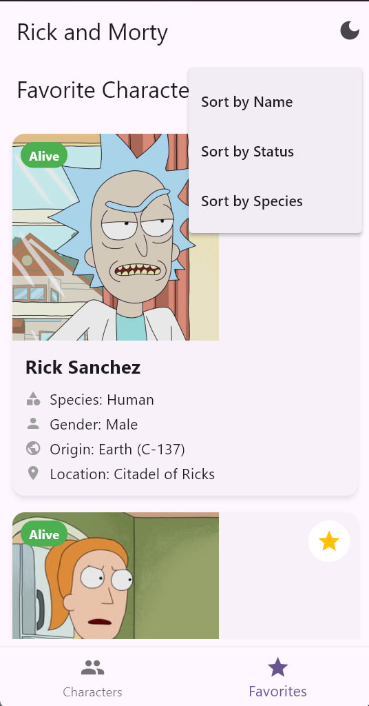
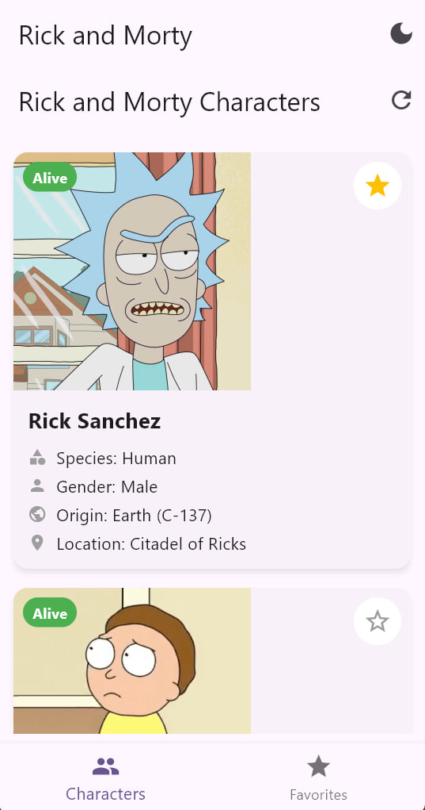
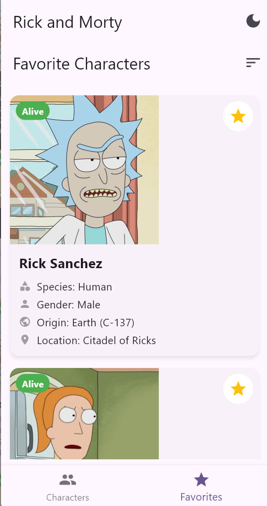
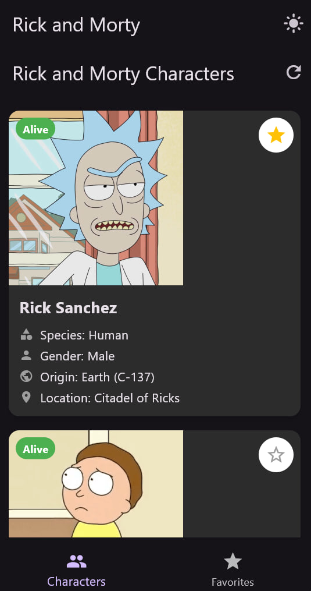

# Rick and Morty Explorer


Мобильное приложение на Flutter для просмотра персонажей из мультсериала "Рик и Морти" с возможностью добавления в избранное и оффлайн-доступом к данным.

## 📱 Скриншоты

<p align="center">
  
  
  
  
</p>

## ✨ Функциональные возможности

- **Обзор персонажей**: Список всех персонажей из мультсериала "Рик и Морти"
- **Подробная информация**: Имя, статус, вид, локация и другие характеристики персонажей
- **Избранное**: Добавление и удаление персонажей из списка избранных
- **Сортировка**: Сортировка избранных персонажей по различным параметрам
- **Оффлайн-режим**: Доступ к данным без подключения к интернету
- **Пагинация**: Автоматическая подгрузка персонажей при скролле
- **Тёмная тема**: Поддержка светлой и тёмной темы интерфейса

## 🔧 Технологии

- **Flutter**: Для создания кроссплатформенного приложения
- **Provider**: Для управления состоянием
- **Hive**: Для хранения данных и работы в оффлайн-режиме
- **HTTP**: Для выполнения API-запросов
- **Cached Network Image**: Для эффективной загрузки и кэширования изображений

## 🚀 Установка и запуск

1. Убедитесь, что у вас установлен Flutter и настроено окружение для разработки
2. Клонируйте репозиторий:
   ```
   git clone https://github.com/yourusername/rick_and_morty_app.git
   ```
3. Перейдите в директорию проекта:
   ```
   cd rick_and_morty_app
   ```
4. Установите зависимости:
   ```
   flutter pub get
   ```
5. Запустите приложение:
   ```
   flutter run
   ```

## 📊 Архитектура

Приложение следует архитектуре Provider Pattern:

- **Models**: Определяют структуру данных (Character, Origin, Location)
- **Services**: Содержат бизнес-логику (API и Database)
- **Providers**: Управляют состоянием приложения и соединяют UI с сервисами
- **Screens**: Экраны приложения (CharactersScreen, FavoritesScreen)
- **Widgets**: Переиспользуемые компоненты UI (CharacterCard, FavoriteButton)

## 🔗 API

Приложение использует [The Rick and Morty API](https://rickandmortyapi.com/):
- Базовый URL: `https://rickandmortyapi.com/api`
- Эндпоинт персонажей: `https://rickandmortyapi.com/api/character`

## 📜 Лицензия

MIT

---

Создано с ❤️ любителям Rick and Morty
